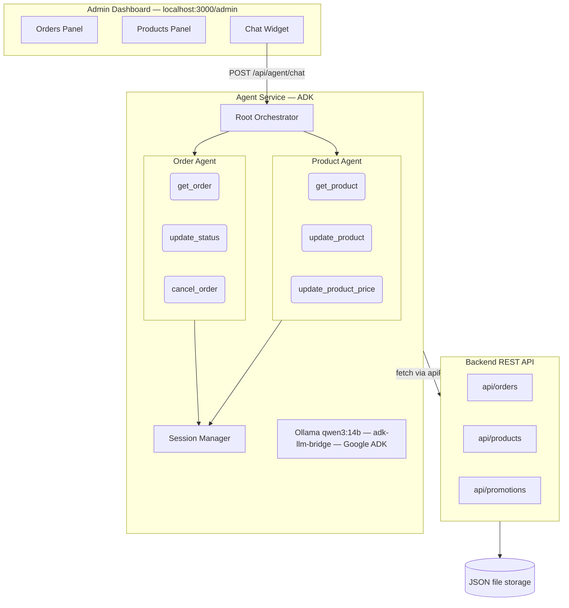
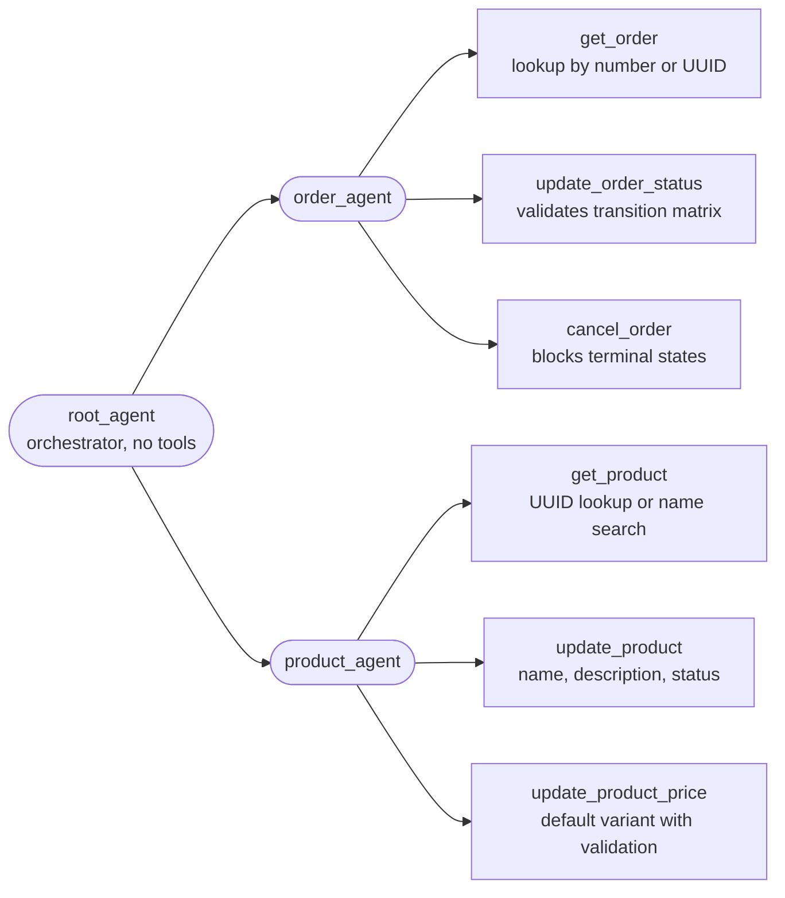

# Store Admin AI Agent — Solution

An AI-powered assistant embedded in the e-commerce admin dashboard that interprets natural-language requests and executes order/product management actions via the existing REST API.

---

## Architecture

### System Overview



### Multi-Agent Topology

The system uses ADK's native `subAgents` mechanism for delegation:



The root agent carries no tools — it only decides which sub-agent should handle a request and transfers control via ADK's built-in `transfer_to_agent`. This is intentionally over-structured for a two-domain system; the benefit is that adding a third domain (e.g., promotions) requires only creating a new folder under `agents/` and registering it.

### Inter-Agent Communication — Why ADK Native over MCP / A2A

Three protocols were evaluated for how sub-agents communicate with the orchestrator:

| Protocol | What It Does | Why It Was Rejected |
|----------|-------------|---------------------|
| **ADK native `subAgents`** ✅ | Sub-agents registered in-process via the `subAgents` array; ADK auto-injects a `transfer_to_agent` tool the LLM can call to delegate | **Selected** — all agents share the same process, model, and session. Zero infrastructure overhead. |
| **Model Context Protocol (MCP)** | Designed for connecting LLMs to external tool servers across process boundaries via stdio/SSE transport and JSON-RPC framing | Our agents are in-memory in the same Node.js process. MCP would add a network protocol layer (transport, serialization, discovery) between components that are already function calls apart. MCP shines when agents need to discover tools at runtime from external services — not our case. |
| **Agent-to-Agent (A2A)** | Google's protocol for inter-service agent communication — agents run as independent HTTP services, advertise capabilities via Agent Cards, and communicate via JSON-RPC | A2A assumes agents are independently deployed services, potentially built by different teams. It requires each sub-agent to run its own HTTP server with health checks, service discovery, and Agent Card endpoints. For a single-process prototype with two tightly-coupled domains, this is pure infrastructure overhead with no benefit. A2A is the right choice in a federated multi-service architecture. |

**In short:** MCP and A2A solve real problems (cross-process tool discovery and cross-service agent federation, respectively), but those problems don't exist in a single-process application where all agents share a model and session. ADK's native delegation gives us the same routing capability with a single array declaration.

### Key Design Decisions

Detailed trade-off analysis is documented in three ADRs under `docs/adr/`:

| ADR | Decision | Key Trade-off |
|-----|----------|---------------|
| [001](docs/adr/001-backend-agent-architecture.md) | Multi-agent orchestrator with ADK | Overkill for two domains, but scales cleanly; chose ADK native sub-agents over MCP/A2A protocols |
| [002](docs/adr/002-frontend-chat-widget.md) | Vanilla JS chat widget | Zero dependencies, consistent with existing stack; chose REST over WebSocket/SSE (ADK doesn't stream) |
| [003](docs/adr/003-agent-testing-strategy.md) | Layered test strategy with mocked boundaries | Mock at `apiRequest` level for tools, module-level for ADK; no E2E with real LLM (non-deterministic) |

---

## Setup Instructions

### Prerequisites

- **Node.js** 18+
- **npm**
- **Ollama** installed locally ([install guide](https://ollama.ai))

### 1. Install Dependencies

```bash
npm install
```

### 2. Pull the LLM Model

```bash
ollama pull qwen3:14b
```

Any Qwen3 model up to 30b works. To use a different size:

```bash
ollama pull qwen3:8b
OLLAMA_MODEL=qwen3:8b npm run dev
```

### 3. Start the Application

```bash
npm run dev
```

The application runs at [http://localhost:3000](http://localhost:3000).

- **Storefront:** [http://localhost:3000](http://localhost:3000)
- **Admin Dashboard:** [http://localhost:3000/admin](http://localhost:3000/admin)
- **API Docs:** [http://localhost:3000/api](http://localhost:3000/api)

### 4. Use the Chat Agent

Open the admin page and click the **💬** floating button in the bottom-right corner. Try:

```
"What is the status of ORD-1001?"
"Cancel order ORD-1008"
"Find a product called headphones"
"Change the price of <product-id> to $199.99"
```

### Environment Variables

| Variable | Default | Description |
|----------|---------|-------------|
| `OLLAMA_MODEL` | `qwen3:14b` | Ollama model name |
| `OLLAMA_BASE_URL` | `http://localhost:11434/v1` | Ollama API endpoint |
| `API_BASE_URL` | `http://localhost:3000` | Backend API base URL |
| `PORT` | `3000` | Server port |

---

## Project Structure

```
src/
├── agent/
│   ├── index.ts              # Root orchestrator — creates and wires all agents
│   ├── instructions.ts       # Root agent system prompt (routing rules)
│   ├── runner.ts             # Session lifecycle + ADK InMemoryRunner wrapper
│   ├── route.ts              # POST /api/agent/chat endpoint
│   ├── config.ts             # Environment-based configuration
│   ├── shared/
│   │   └── helpers.ts        # apiRequest wrapper, isUUID, ESM import shim
│   └── agents/
│       ├── order/
│       │   ├── index.ts      # Order agent factory
│       │   ├── instructions.ts # Order-specific system prompt
│       │   └── tools.ts      # get_order, update_order_status, cancel_order
│       └── product/
│           ├── index.ts      # Product agent factory
│           ├── instructions.ts # Product-specific system prompt
│           └── tools.ts      # get_product, update_product, update_product_price
├── __tests__/
│   └── agent/
│       ├── orchestrator.test.ts  # Root + sub-agent wiring tests
│       ├── order-tools.test.ts   # Order tool validation and execution
│       ├── product-tools.test.ts # Product tool validation and execution
│       ├── runner.test.ts        # Session lifecycle and response extraction
│       ├── route.test.ts         # HTTP endpoint validation and errors
│       └── helpers.test.ts       # UUID detection and API request handling
public/
├── admin.html                # Admin page (with embedded chat widget)
└── admin/
    ├── admin.css / admin.js  # Existing admin UI
    ├── chat.css              # Chat widget styles
    └── chat.js               # Chat widget logic
docs/
└── adr/                      # Architecture Decision Records
    ├── 001-backend-agent-architecture.md
    ├── 002-frontend-chat-widget.md
    └── 003-agent-testing-strategy.md
```

---

## Testing

### Run Agent Tests

```bash
npx jest --testPathPattern='__tests__/agent/' --verbose
```

### Run All Tests

```bash
npm test
git restore data/seed/   # restore seed data (existing test setup resets it)
```

### Test Summary

| Suite | Tests | What's Covered |
|-------|-------|----------------|
| Orchestrator | 14 | Root agent wiring, sub-agent registration, prompt routing rules |
| Order tools | 26 | Status transition matrix, UUID vs order-number routing, cancellation guards |
| Product tools | 17 | UUID lookup, name search, field validation, price edge cases |
| Runner | 6 | Session create/reuse, multi-event text assembly, fallback responses |
| Route handler | 9 | Input validation, session ID lifecycle, error propagation |
| Helpers | 8 | UUID detection, API request wrapping, network error handling |
| **Total** | **80** | All external dependencies (LLM, ADK, API) are mocked |

---

## Agent Capabilities

### Orders

| Action | Example Prompt | What Happens |
|--------|----------------|-------------|
| Look up | "What is the status of ORD-1001?" | Fetches order by number or UUID, returns formatted summary |
| Update status | "Ship order ORD-1004" | Validates transition (e.g., processing → shipped), calls API |
| Cancel | "Cancel order ORD-1008" | Blocks if terminal state (completed, refunded), otherwise cancels |

### Products

| Action | Example Prompt | What Happens |
|--------|----------------|-------------|
| Look up | "Find products with headphones" | Searches by name, returns top matches with IDs |
| Update fields | "Change product name to Premium Headphones" | Updates name/description/status via API |
| Update price | "Set price to $199.99" | Validates ≥ 0, updates default variant price |

### Validation Rules

- **Order transitions:** Enforced via a state machine matrix (e.g., `pending → confirmed ✓`, `cancelled → pending ✗`)
- **Price validation:** Rejects negative prices before calling the API
- **Product updates:** Requires at least one field to be provided
- **Identifier routing:** Automatically detects UUID vs order number format

---

## Known Limitations

1. **No streaming responses** — The ADK `InMemoryRunner` collects the full LLM response before returning. Users see a typing indicator for 3–10 seconds. Switching to SSE would require a backend change but no widget restructure.

2. **Model-dependent quality** — Smaller models (≤ 8B) may struggle with multi-agent delegation, sometimes outputting raw JSON instead of calling `transfer_to_agent`. The 14B+ models handle this reliably.

3. **In-memory sessions** — Both the agent runner sessions and the chat widget's session ID are in-memory. A server restart or page reload clears conversation history. Production would use Redis or a database-backed session store.

4. **No authentication** — The agent endpoint has no auth middleware. In production, it would sit behind the same admin auth that protects `/admin`.

5. **ESM/CJS workaround** — The `@google/adk` package is ESM-only but the project is CommonJS. A `new Function('modulePath', 'return import(modulePath)')` wrapper bridges the gap at runtime. This works reliably but is a pragmatic hack, not a long-term solution. Migrating the project to ESM would eliminate it.

6. **Seed data mutation during tests** — The existing test setup (`src/__tests__/setup.ts`) resets `data/seed/*.json` to empty arrays. Run `git restore data/seed/` after `npm test` to recover seed data.

---

## Future Improvements

With additional time, the following would add production value:

- **Streaming responses** via Server-Sent Events for real-time token display
- **Persistent sessions** using Redis for cross-restart conversation continuity
- **Promotion agent** — a third sub-agent to manage discounts and coupon codes
- **Confirmation flow** — require explicit user confirmation before destructive actions (cancel, price changes)
- **Structured responses** — render order tables and product cards in the chat widget instead of plain text
- **Observability** — OpenTelemetry tracing across agent → tool → API calls

---

## AI Tools Usage

AI coding assistants (Cursor with Claude) were used throughout development for:

- **Boilerplate generation** — initial tool definitions, test scaffolding, CSS layout
- **Debugging** — ADK API drift (constructor signatures changed between versions), ESM/CJS compatibility
- **Documentation** — ADR drafting and README structure

All generated code was reviewed, understood, and modified. Architectural decisions (multi-agent vs single-agent, mocking strategy, vanilla JS vs React) were made by the developer based on trade-off analysis.
